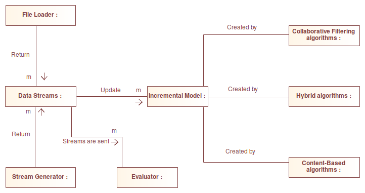

# FEUP-DISS

Dissertation topic on a **Software Library for Stream Based Recommender Systems**.

## Overall architecture

1. Data Streams can be created through heir own class, or through file loader or stream generator methods.
2. They are sent to a prequential evaluator, so that we can test the current model before the updating phase.
3. The model is updated with the data stream.
4. The model is created through incremental algorithms.
